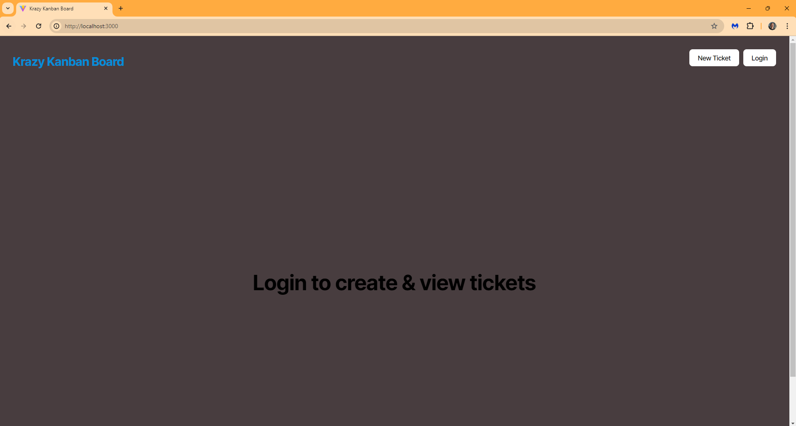

# 14 Full-Stack React: Kanban Board

## Description

This app gives the user the ability to login to view their kan ban board. Users can create tasks, update tasks, and delete tasks. The user is also able to log out of their account if they wish.

## Deployed App

https://full-stack-homework.onrender.com

> **important** Make sure to download and unzip the starter code files and make your own repository with the starter code.

Before you start, download the [starter code](https://static.bc-edx.com/coding/software-dev/14-Full-Stack-React/Develop.zip).

## User Story

```md
AS A member of an agile team
I WANT a Kanban board with a secure login page
SO THAT I can securely access and manage my work tasks
```

## Acceptance Criteria

```md
GIVEN a Kanban board with a secure login page
WHEN I load the login page
THEN I am presented with form inputs for username and password
WHEN I enter my valid username and password
THEN I am authenticated using JSON Web Tokens (JWT) and redirected to the main Kanban board page
WHEN I enter an invalid username or password
THEN I am presented with an error message indicating that the credentials are incorrect
WHEN I successfully log in
THEN a JWT is stored securely in the client's local storage for subsequent authenticated requests
WHEN I log out
THEN the JWT is removed from the client's local storage and I am redirected to the login page
WHEN I try to access the Kanban board page without being authenticated
THEN I am redirected to the login page
WHEN I remain inactive for a defined period
THEN my session expires, the JWT is invalidated, and I am redirected to the login page upon my next action
```

## Mock-Up

The following images show the web application's appearance and functionality:




## Getting Started

The starter code provides a complete, working full-stack application without authentication.

You will need to:

* Create a `.env` file for the server that includes:

  * A username for the database

  * A password for the database

  * A secret key for the JWT (this can be any random string)

* Complete the `authenticateToken` method in `server/src/middleware/auth.ts`

* Complete the login method in `server/src/routes/auth-routes.ts`

* Add authentication to the API routes in `server/src/routes/index.ts`

* Complete the login method in `client/src/api/authAPI.tsx`

* Complete the methods of the `AuthService` in `client/src/utils/auth.ts`

You can refer to the [Deploy with Render and PostgreSQL guide](https://coding-boot-camp.github.io/full-stack/render/deploy-with-render-and-postgresql) and the [Render documentation on setting environment variables](https://docs.render.com/configure-environment-variables) as needed.

